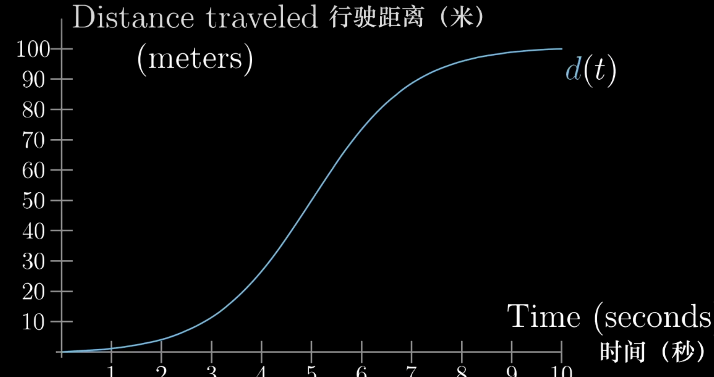
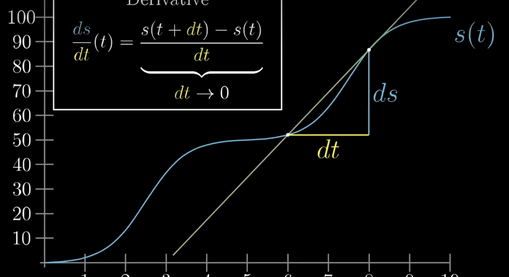
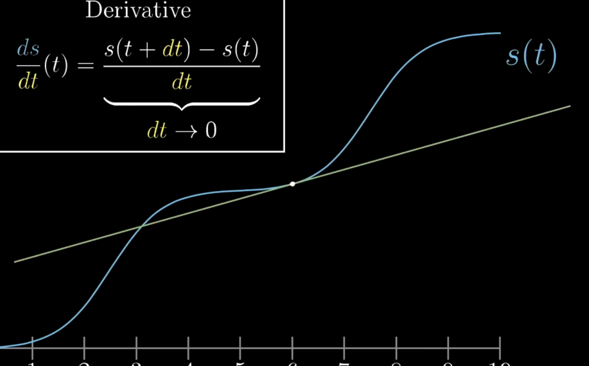

### 顺势变化率？
导数的测量指的是：顺势变化率？

矛盾点:不同时间点“变化”才会发生，当限制在某一个时间点时的变化率，相对于总体的变化率（这里的“变化”不能代表总体的变化）

### 导数的图像

$ds\over dt$ 这里的$dt$为0时，这两点也越来越接近，两点直线的斜率也就越来越逼近在t点时图像切线的斜率。
所以，导数在数学上真正的完全体，并不是沿图像两点间直线的斜率，而是经过图像上某一点的切线的斜率
