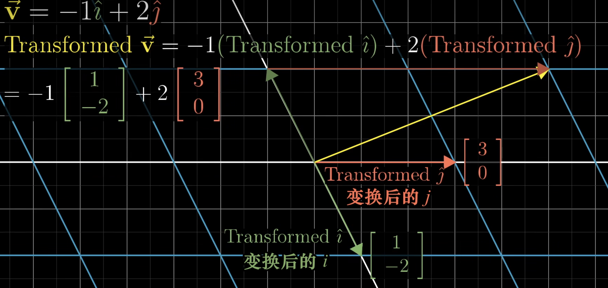
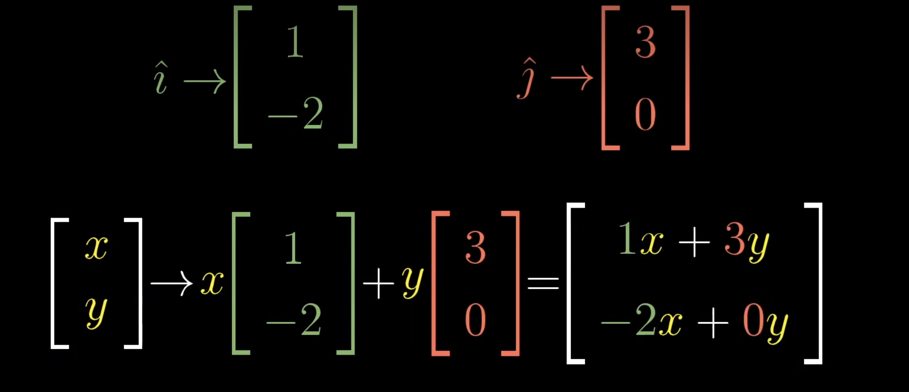

### 线性变换

# 线性变换的概念

## 什么是线性变换？
**线性变换**是从一个向量空间到另一个向量空间的映射，满足以下两个基本性质：
1. **加法的封闭性**：对任意两个向量 \(\mathbf{u}\) 和 \(\mathbf{v}\)，有：
   \[
   T(\mathbf{u} + \mathbf{v}) = T(\mathbf{u}) + T(\mathbf{v})
   \]
2. **数乘的封闭性**：对任意向量 \(\mathbf{v}\) 和标量 \(c\)，有：
   \[
   T(c\mathbf{v}) = cT(\mathbf{v})
   \]

这里的 \(T\) 表示一个线性变换。

---

## 表示方法
- 若将向量用坐标表示，线性变换通常可以通过一个**矩阵**来表示：
  \[
  T(\mathbf{v}) = A\mathbf{v}
  \]
  其中 \(A\) 是一个矩阵，\(\mathbf{v}\) 是一个列向量。

---

## 几何意义
1. **线性变换的效果**：
   - 将原向量空间中的向量映射到另一个向量空间中。
   - 保留了向量之间的线性关系（直线仍为直线，原点不移动）。

2. **常见几何变换**：
   - **缩放**：改变向量的大小，但不改变方向。
   - **旋转**：绕原点旋转向量。
   - **反射**：关于某条轴对称。
   - **剪切**：改变角度，但保持直线性。

---

## 示例
### 1. **二维线性变换**
假设 \(T\) 是从 \(\mathbb{R}^2\) 到 \(\mathbb{R}^2\) 的线性变换，矩阵为：
\[
A = \begin{bmatrix}
2 & 0 \\
0 & 3
\end{bmatrix}
\]
对任意向量 \(\mathbf{v} = \begin{bmatrix} x \\ y \end{bmatrix}\)，变换后的结果为：
\[
T(\mathbf{v}) = A\mathbf{v} = \begin{bmatrix}
2 & 0 \\
0 & 3
\end{bmatrix}
\begin{bmatrix}
x \\
y
\end{bmatrix} = \begin{bmatrix}
2x \\
3y
\end{bmatrix}
\]
几何意义：将 \(\mathbf{v}\) 在 \(x\)-轴方向拉伸 2 倍，在 \(y\)-轴方向拉伸 3 倍。

### 2. **旋转变换**
若 \(T\) 是一个旋转变换，其矩阵为：
\[
A = \begin{bmatrix}
\cos\theta & -\sin\theta \\
\sin\theta & \cos\theta
\end{bmatrix}
\]
这表示将向量绕原点逆时针旋转角度 \(\theta\)。

---

## 特性
1. **保持原点不变**：
   - 线性变换 \(T(\mathbf{0}) = \mathbf{0}\)。

2. **作用在基向量上**：
   - 线性变换完全由基向量的映射决定。例如，若 \(\mathbf{e_1}, \mathbf{e_2}\) 是二维空间的标准基向量，则只需知道：
     \[
     T(\mathbf{e_1}), T(\mathbf{e_2})
     \]
     即可推导 \(T\) 对任意向量的作用。

3. **可组合性**：
   - 两个线性变换的复合仍然是线性变换。
   - 若 \(T_1(\mathbf{v}) = A\mathbf{v}\)，\(T_2(\mathbf{v}) = B\mathbf{v}\)，则复合变换为：
     \[
     T_2(T_1(\mathbf{v})) = B(A\mathbf{v}) = (BA)\mathbf{v}
     \]

---

## 应用
1. **计算机图形学**：
   - 平移、旋转、缩放、剪切等几何变换。
   - 用矩阵实现图形的变换和操作。

2. **数据科学**：
   - 降维（如 PCA）可以看作线性变换的应用。

3. **工程学与物理学**：
   - 描述物体在不同坐标系下的状态。

4. **机器学习**：
   - 线性模型（如线性回归、神经网络中的线性层）依赖线性变换表示输入与输出的关系。

# 矩阵的概念

## 什么是矩阵？
**矩阵**（Matrix）是一个按照行和列排列的二维数组，用来表示数据或描述数学运算，特别是在线性代数中。矩阵通常用大写字母表示，如 \(A, B, C\)。

一个 \(m \times n\) 的矩阵由 \(m\) 行和 \(n\) 列元素组成：
\[
A = \begin{bmatrix}
a_{11} & a_{12} & \cdots & a_{1n} \\
a_{21} & a_{22} & \cdots & a_{2n} \\
\vdots & \vdots & \ddots & \vdots \\
a_{m1} & a_{m2} & \cdots & a_{mn}
\end{bmatrix}
\]
其中，\(a_{ij}\) 表示矩阵 \(A\) 中第 \(i\) 行、第 \(j\) 列的元素。

---

## 矩阵的几何直观
在几何中，矩阵通常用于描述变换（如旋转、缩放、反射等）。矩阵可以看作是对空间中的向量进行操作的工具。

---

## 矩阵的分类
1. **按维度分类**：
   - **行矩阵**：只有一行的矩阵（如 \(1 \times n\)）。
   - **列矩阵**：只有一列的矩阵（如 \(m \times 1\)）。
   - **方阵**：行数与列数相等的矩阵（如 \(n \times n\)）。

2. **特殊矩阵**：
   - **零矩阵**：所有元素均为 0。
   - **对角矩阵**：只有主对角线上的元素非零。
   - **单位矩阵**：对角线元素为 1，其余为 0，用 \(I\) 表示。
   - **对称矩阵**：满足 \(A^T = A\) 的矩阵。
   - **反对称矩阵**：满足 \(A^T = -A\) 的矩阵。

---

## 矩阵的基本运算
### 1. **加法与减法**
两个矩阵的加法或减法要求它们的维度相同，对应位置的元素相加或相减：
\[
A + B = \begin{bmatrix}
a_{11} + b_{11} & a_{12} + b_{12} \\
a_{21} + b_{21} & a_{22} + b_{22}
\end{bmatrix}
\]

### 2. **数乘**
矩阵的每个元素与标量 \(c\) 相乘：
\[
cA = \begin{bmatrix}
c \cdot a_{11} & c \cdot a_{12} \\
c \cdot a_{21} & c \cdot a_{22}
\end{bmatrix}
\]

### 3. **矩阵乘法**
矩阵 \(A\) 与矩阵 \(B\) 的乘法定义为：
\[
(A \cdot B)_{ij} = \sum_{k=1}^n a_{ik} b_{kj}
\]
仅当 \(A\) 的列数等于 \(B\) 的行数时，矩阵乘法才定义。

### 4. **转置**
矩阵转置是将行与列互换：
\[
A^T = \begin{bmatrix}
a_{11} & a_{21} \\
a_{12} & a_{22}
\end{bmatrix}
\]

### 5. **逆矩阵**
方阵 \(A\) 的逆矩阵 \(A^{-1}\) 满足：
\[
A \cdot A^{-1} = I
\]
只有可逆矩阵才存在逆矩阵。

---

## 矩阵的应用
1. **几何变换**：
   - 描述旋转、缩放、平移等操作。

2. **物理学**：
   - 用于描述系统状态和动力学（如量子力学的状态向量）。

3. **计算机科学**：
   - 图像处理（矩阵形式存储图像像素）。
   - 图形学中的空间变换。

4. **机器学习与数据科学**：
   - 表示数据集和模型参数。
   - 用于线性代数相关的计算（如特征值分解、奇异值分解）。

5. **网络分析**：
   - 邻接矩阵用于表示图的结构。

---

## 示例
### 二维空间的线性变换
矩阵 \(A = \begin{bmatrix} 2 & 0 \\ 0 & 3 \end{bmatrix}\) 表示一个缩放变换：
- 将 \(x\)-方向拉伸为原来的 2 倍。
- 将 \(y\)-方向拉伸为原来的 3 倍。

输入向量 \(\mathbf{v} = \begin{bmatrix} 1 \\ 1 \end{bmatrix}\)，其输出为：
\[
A \mathbf{v} = \begin{bmatrix} 2 & 0 \\ 0 & 3 \end{bmatrix} \begin{bmatrix} 1 \\ 1 \end{bmatrix} = \begin{bmatrix} 2 \\ 3 \end{bmatrix}
\]

---

# 矩阵作用下的向量变换

## 1. 空间的映射
矩阵 \( A \) 可以被看作是一种“工具”，用于将向量从一个空间映射到另一个空间。假设有一个向量 \(\mathbf{v} = \begin{bmatrix} x \\ y \end{bmatrix}\)，通过矩阵 \( A \) 作用得到新的向量：
\[
\mathbf{v'} = A\mathbf{v} = \begin{bmatrix} a & b \\ c & d \end{bmatrix} \begin{bmatrix} x \\ y \end{bmatrix}
\]
新向量 \(\mathbf{v'} = \begin{bmatrix} ax + by \\ cx + dy \end{bmatrix}\)，它在空间中的位置与原向量 \(\mathbf{v}\) 通常不同。

---

## 2. 几何解释
矩阵对向量的作用可以看成是对整个二维空间（或网格）的**线性变换**。这包括：

1. **旋转**：矩阵可以将空间绕原点旋转某个角度。
2. **缩放**：矩阵可以将空间沿某些方向放大或缩小。
3. **剪切**：矩阵可以将矩形网格拉伸成平行四边形网格。
4. **反射**：矩阵可以将空间关于某个轴对称翻转。

例如，矩阵 \( A = \begin{bmatrix} 2 & 0 \\ 0 & 3 \end{bmatrix} \) 表示将 \(x\)-轴方向拉伸 2 倍，\(y\)-轴方向拉伸 3 倍。

---

## 3. 基的变换
矩阵对向量的变换，可以看作是对空间中的基向量进行操作：
- 在二维空间中，基向量通常为标准基 \(\mathbf{e_1} = \begin{bmatrix} 1 \\ 0 \end{bmatrix}\) 和 \(\mathbf{e_2} = \begin{bmatrix} 0 \\ 1 \end{bmatrix}\)。
- 矩阵 \( A \) 会将 \(\mathbf{e_1}\) 和 \(\mathbf{e_2}\) 分别映射到新的位置：
  \[
  A\mathbf{e_1} = \begin{bmatrix} a \\ c \end{bmatrix}, \quad A\mathbf{e_2} = \begin{bmatrix} b \\ d \end{bmatrix}
  \]
- 其他向量在变换后的位置由这些新基向量的线性组合决定。

---

## 4. 举例说明
### 示例：旋转变换
矩阵 \( A = \begin{bmatrix} \cos\theta & -\sin\theta \\ \sin\theta & \cos\theta \end{bmatrix} \) 表示将空间中的所有向量绕原点逆时针旋转角度 \(\theta\)。

- 原向量 \(\mathbf{v} = \begin{bmatrix} 1 \\ 0 \end{bmatrix}\) 在变换后变为：
  \[
  A\mathbf{v} = \begin{bmatrix} \cos\theta \\ \sin\theta \end{bmatrix}
  \]
- 这表明整个坐标系都被旋转了 \(\theta\) 角度。

### 示例：缩放与剪切
矩阵 \( A = \begin{bmatrix} 2 & 1 \\ 0 & 1 \end{bmatrix} \) 表示：
- 将 \(x\)-轴方向拉伸 2 倍，同时 \(x\)-方向的变化会影响 \(y\) 的值（剪切效应）。

对于向量 \(\mathbf{v} = \begin{bmatrix} 1 \\ 1 \end{bmatrix}\)：
\[
A\mathbf{v} = \begin{bmatrix} 2 & 1 \\ 0 & 1 \end{bmatrix} \begin{bmatrix} 1 \\ 1 \end{bmatrix} = \begin{bmatrix} 3 \\ 1 \end{bmatrix}
\]

---

## 5. 总结
矩阵运算对向量的作用可以看作是对空间的变换：
- 改变了网格的形状。
- 对向量重新定位，反映出空间的几何性质。

这种变换可以应用于二维平面或更高维空间的各种场景，包括图形学、物理建模和数据分析等。
